# Finetune diffusion models

The goal of this repository is to facilitate the finetuning of diffusion models.

This task can be split into three main steps:
- Data retrieval
- Captioning
- Finetuning

Here are some examples of what you can get after finetuning (on Magic cards and on One piece characters)

Prompt | Image (magic finetuned) | Image (one piece finetuned)
--- | --- | ---
Elon Musk | 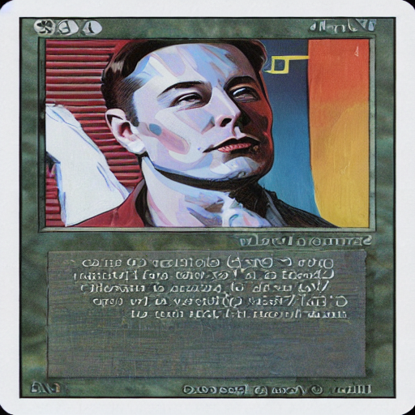 | 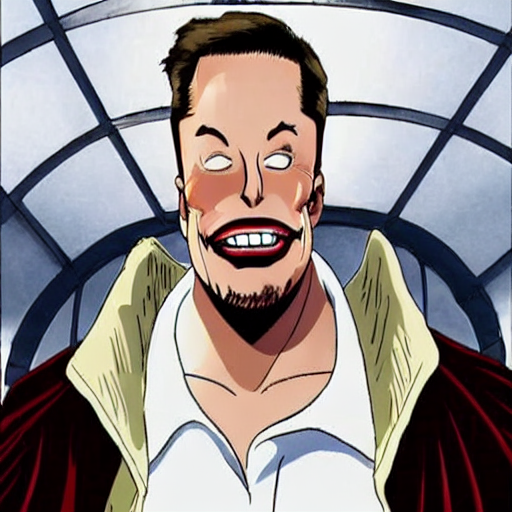
Harry Potter | 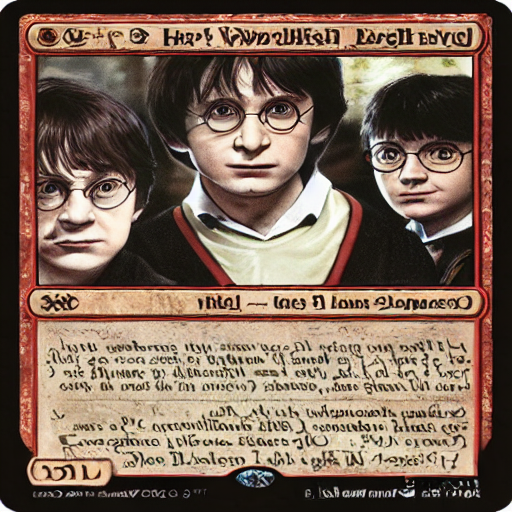 | 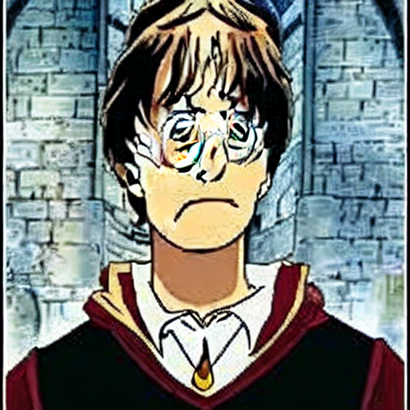
Yoda | 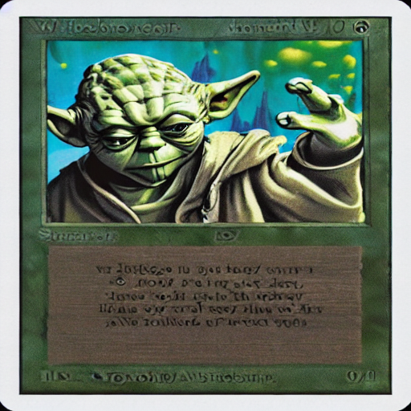 | 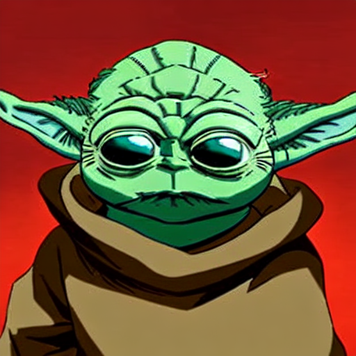
Obama | 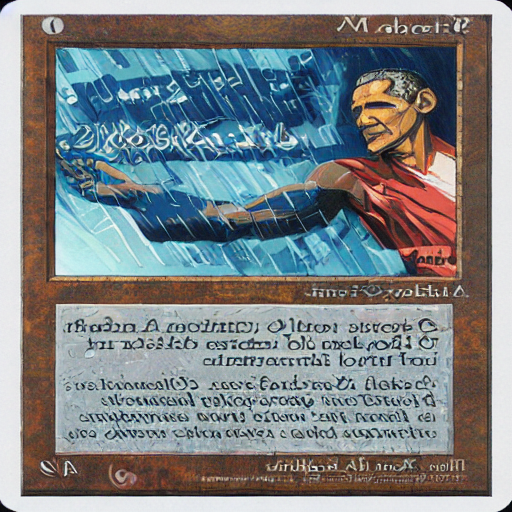 | 
Zeus | 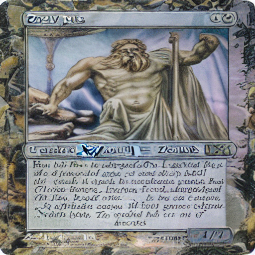 | 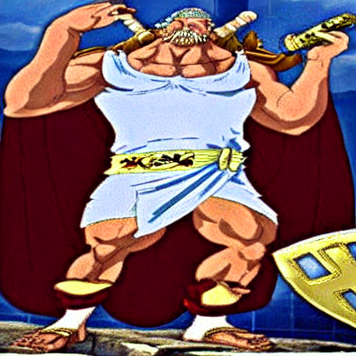
Flying dog | 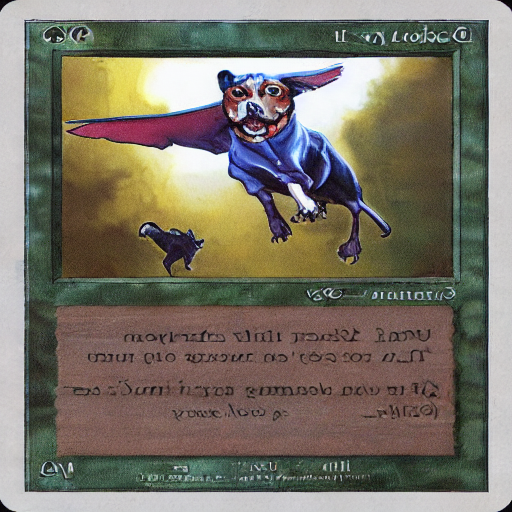 | 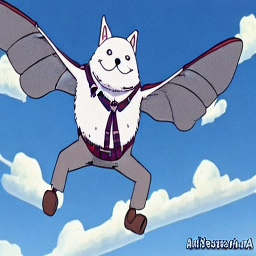
Monster with three eyes on a bike | 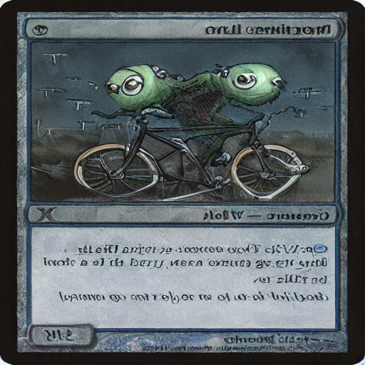 | 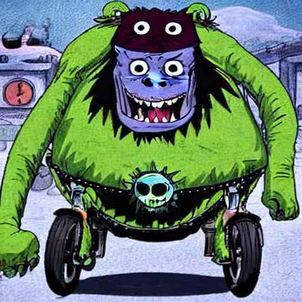
A mountain with rocks | 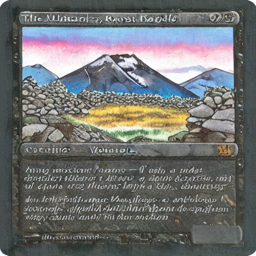 | 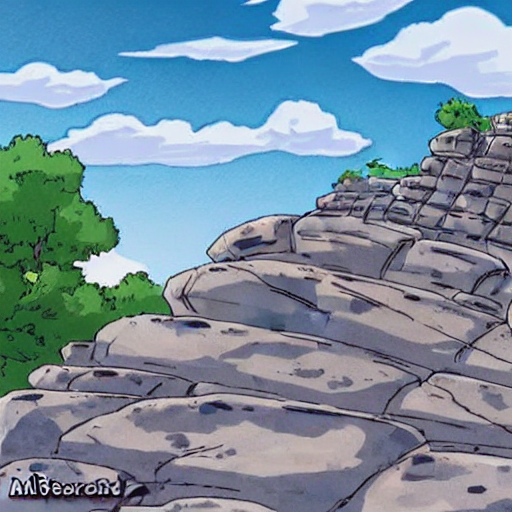


## Requirements

- **Hardware**
    - To launch the finetuning with a batch_size of 1 you need to have a gpu with at least 24G VRAM (you can use accumulating gradient to simulate higher batch size)
    - Make sure that you have enough disk space, the model uses ~11Gb

- **Software**
    - A HuggingFace account is necessary to upload datasets and models
        - Click on Access the repository of https://huggingface.co/CompVis/stable-diffusion-v1-4 while being logged in
        - Authenticate to HuggingFace 
        ```bash
        huggingface-cli login
        ```
    - Git lfs should be installed as well
    ```bash
    curl -s https://packagecloud.io/install/repositories/github/git-lfs/script.deb.sh | sudo bash
    sudo apt-get install git-lfs
    ```
    - Python >=3.8

- **Other**
    - BLIP requires transformers==4.15.0
    - Finetuning requires transformers==4.22.0
    - Based on the script launched (captioning or finetuning) it will automatically install the correct version of transformers
- **Requirements**
```bash
pip install -r requirements.txt
```


## Data retrieval
You need to collect all the images on which you want to finetune. All of those images must be put in the `./data` folder.
Those images will be converted to `.jpeg` later in the process. Having around 1K diverse images is good magnitude to get interesting results after finetuning.


## Captioning
The second step is captioning, describing every images. The result is a json file called: `./captions.json`. The keys are the relative paths
to the images and the value is the caption

**Example**
```json
{"./data/yolo.jpeg": "A nice bird flying", "./data/yolo2.jpeg": "A dog sleeping on grass"}
```

If you do not have any captioning this can be done using for instance [BLIP](https://github.com/salesforce/BLIP)

### Caption using BLIP
First we need to clone the BLIP project
```bash
git clone https://github.com/salesforce/BLIP
cd BLIP
git checkout  6b5ca0d
touch __init__.py
cd ..
```

Then you can launch the script `caption.py`
```bash
# Make sure to be inside BLIP because it needs specific scripts of the repository
cd BLIP
# The captioning requires transformers 4.15.0
tf_version=`pip show transformers | grep Version: | cut -d ' ' -f2`
if [[ $tf_version == "4.22.0" ]]; then
    pip uninstall -y transformers && pip install transformers==4.15.0
fi
python ../caption.py
```

It will read all of the images in the `./data` folder and create:
- `./data_` folder with all images from `./data` saved as jpeg
- `./captions.json` file


### Upload the dataset to Hugging Face hub
Before finetuning we need to setup the dataset.

You can save your dataset locally or in Hugging Face hub


#### Locally


Once it is done you can launch the following script that will upload the dataset
```bash
python create_dataset.py --save_to_disk --dataset_name DATASET_NAME
```
#### In HuggingFace hub

Make sure you are authenticated using
```bash
huggingface-cli login
```

Once it is done you can launch the following script that will upload the dataset
```bash
python create_dataset.py --dataset_name DATASET_NAME
```

You should verify that your dataset is available in https://huggingface.co/datasets/YOURNAME/DATASET_NAME.
You can create a specific README to have a dataset preview. You can modify the `dataset_README_template.md` accordingly and upload it
as `README.md` in your dataset repository.


## Finetuning
The script is mainly inspired from [Diffuser finetuning script](https://github.com/huggingface/diffusers/tree/main/examples/text_to_image), it was modified before
this script was merged to diffusers. I may create an MR on diffusers to add new features for the finetuning.

As said before the finetuning requires a GPU with at least 24GB of VRAM. Moreover it can overfits quite easily.
It is advised to follow the finetuning at every epoch and stop when overfitting is observed.

To do so you can specify some specfic text inputs that should be tested every epoch. Then you can follow the evolution
of your requests by the epoch and thus stop the finetuning processing when necessary.

Please add the text input (one per line) in the `finetuning_validation.txt` file.
```
Yoda
Obama
Elon Musk
Harry Potter
A mountain with rocks
A flying bird
A dog running
```


You can then launch the following script:
- **From HuggingFace Hub**
    ```bash
    # The finetuning requires transformers 4.22.0
    tf_version=`pip show transformers | grep Version: | cut -d ' ' -f2`
    if [[ $tf_version == "4.15.0" ]]; then
        pip uninstall -y transformers && pip install transformers==4.22.0
    fi
    
    NAME_MODEL_REPOSITORY=TODO
    NAME_DATASET_REPOSITORY=TODO
    USERNAME=TODO
    MODEL_PRETRAINED=CompVis/stable-diffusion-v1-4
    python train_text_to_image.py \
        --dataset_name "${USERNAME}/${NAME_DATASET_REPOSITORY}" --pretrained_model_name_or_path "${MODEL_PRETRAINED}" \
        --center_crop --random_flip \
        --gradient_accumulation_steps=8 --max_grad_norm=1 \
        --resolution 512 \
        --mixed_precision fp16 \
        --learning_rate=1e-05 \
        --train_batch_size 1 \
        --num_train_epochs 1500 \
        --upload_every_epoch 5 \
        --lr_scheduler="constant" --lr_warmup_steps=0 --push_to_hub \
        --output_dir "${NAME_MODEL_REPOSITORY}"
    ```

- **From disk**, Make sure to use the **--dataset_from_disk** flag if the dataset was saved locally.
    ```bash
    # The finetuning requires transformers 4.22.0
    tf_version=`pip show transformers | grep Version: | cut -d ' ' -f2`
    if [[ $tf_version == "4.15.0" ]]; then
        pip uninstall -y transformers && pip install transformers==4.22.0
    fi
    NAME_MODEL_REPOSITORY=TODO
    NAME_DATASET_REPOSITORY=TODO
    USERNAME=TODO
    MODEL_PRETRAINED=CompVis/stable-diffusion-v1-4
    python train_text_to_image.py \
        --dataset_name "datasets/${NAME_DATASET_REPOSITORY}" --pretrained_model_name_or_path "${MODEL_PRETRAINED}" \
        --center_crop --random_flip \
        --gradient_accumulation_steps=8 --max_grad_norm=1 \
        --resolution 512 \
        --mixed_precision fp16 \
        --learning_rate=1e-05 \
        --train_batch_size 1 \
        --num_train_epochs 1500 \
        --upload_every_epoch 5 --dataset_from_disk \
        --lr_scheduler="constant" --lr_warmup_steps=0 --push_to_hub \
        --output_dir "${NAME_MODEL_REPOSITORY}"
    ```


After each epoch all the input txt in `finetuning_validation.txt` are used to generate images, those images will be available in a specific folder `./data/results/INPUT_TEXT` by input text allowing you to observe the evolution.

The model is uploaded every 5 epochs to your model repository in huggingFace hub, this can be modified through the paramter **--upload_every_epoch**

## Inference

### Locally
Your model is also stored locally in `output_dir` defined before. You can load it and test it using the following script.

```python
from diffusers import StableDiffusionPipeline

model_path = "path_to_saved_model"
pipe = StableDiffusionPipeline.from_pretrained(model_path, torch_dtype=torch.float16)
pipe.to("cuda")

prompt = "a rabbit flying"
image = pipe(prompt=prompt).images[0]
image.save("yoda-pokemon.png")
```

### HuggingFace Hub
You can use your model uploaded into your Hugging Face repository to launch some local inference
```python
from diffusers import StableDiffusionPipeline

model_path = "USER_NAME/REPO_NAME"
# You can add a parameter called revision to pull a model from a specific commit
#pipe = StableDiffusionPipeline.from_pretrained(model_path, revision ="COMMIT_HASH", torch_dtype=torch.float16)
pipe = StableDiffusionPipeline.from_pretrained(model_path, torch_dtype=torch.float16)
pipe.to("cuda")

prompt = "a rabbit flying"
image = pipe(prompt=prompt).images[0]
image.save("yoda-pokemon.png")
```

## Examples

It is then possible to create a space for testing directly on HuggingFace, you can copy paste the spaces of those two examples for instance and modify
the path of the model :)

Sorry for the latency (several minutes), I may update my HuggingFace account to get a gpu for inference.

### Text to One piece
A diffusion model finetuned on images of all characters from One piece.
- [Model](https://huggingface.co/YaYaB/sd-onepiece-diffusers-test)
- [Space demo](https://huggingface.co/spaces/YaYaB/text-to-onepiece)

### Text to Magic card
A diffusion model finetuned on images of all Creature type from Magic card
- [Model](https://huggingface.co/YaYaB/sd-magic-diffusers-test2)
- [Space demo](https://huggingface.co/spaces/YaYaB/text-to-magic)


## Acknowledgements
All of this work is mainly based on [LambdaLabs' work](https://github.com/LambdaLabsML/examples/tree/main/stable-diffusion-finetuning) and [HuggingFace's diffusers](https://github.com/huggingface/diffusers/tree/main/examples/text_to_image).

